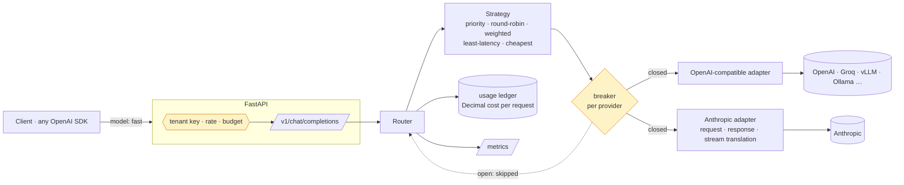

# model-router

[](https://github.com/daniellopez882/model-router/actions/workflows/ci.yml)


An OpenAI-compatible gateway in front of several model providers. Clients
speak the chat-completions API they already use and name a **route alias**
instead of a vendor's model; the router picks a provider by policy, retries
and falls back on the failures that deserve it, refuses the ones that do not,
and charges every request to a tenant with a budget.

It is one of five components of an agent platform — the model router, an
[agent sandbox](https://github.com/daniellopez882/agent-sandbox), an
[agent control plane](https://github.com/daniellopez882/agent-control-plane),
an [evaluation harness](https://github.com/daniellopez882/agent-evals) and an
[observability service](https://github.com/daniellopez882/agent-observability)
— each of which runs on its own.

## At a glance

| | |
|---|---|
| **Speaks** | `POST /v1/chat/completions` (JSON and SSE streaming), `GET /v1/models`; the OpenAI error envelope, so unmodified OpenAI SDKs work |
| **Routes** | Aliases → ordered candidates by `priority`, `round_robin`, `weighted_random`, `least_latency` (EWMA) or `cheapest` |
| **Survives** | Per-candidate retries on retryable failures only, fallback across candidates, a circuit breaker per provider with half-open trials |
| **Accounts** | Tenants with hashed API keys, token-bucket rate limits, monthly USD budgets; Decimal costs from a mandatory price book; a usage ledger |
| **Reports** | Prometheus metrics, JSON logs with request ids, `x-router-*` headers on every reply, `/health` and `/ready` |
| **Tests** | 95 offline: the HTTP surface end to end against a deterministic fake upstream over ASGI, the Anthropic translation over a mocked wire, and Hypothesis properties for the breaker, the bucket, the strategies and the cost arithmetic |
| **Ships** | A non-root image, a compose file that runs the whole system with no provider account, Alembic migrations, a CLI |

## Architecture



### One request

```mermaid
sequenceDiagram
    autonumber
    participant C as Client
    participant G as Gate
    participant R as Router
    participant A as Provider A
    participant B as Provider B
    C->>G: POST /v1/chat/completions {model: "fast"} + Bearer key
    G->>G: key → tenant · token bucket · month spend < budget
    G-->>C: 401 / 403 / 429 Retry-After / 402 on failure
    G->>R: request
    R->>R: alias → candidates, ordered by strategy; skip open breakers
    R->>A: chat (retry ≤ max_retries on retryable failures only)
    A-->>R: 503
    R->>B: fall back
    B-->>R: 200 + usage
    R->>R: cost = tokens × price (Decimal) · EWMA latency · breaker success
    R-->>C: 200, body.model = "fast", x-router-provider: B, x-router-cost-usd
    Note over R: every candidate failed → 502, or 503 + Retry-After if all failures said "later"
```

## Quick start

No provider account is needed: the compose file runs the router in front of
a deterministic fake upstream.

```bash
ADMIN_TOKEN=change-me docker compose up -d --build
curl -s http://127.0.0.1:8080/ready

# create a tenant; the key is shown once
curl -s -X POST http://127.0.0.1:8080/admin/tenants -H 'X-Admin-Token: change-me' \
     -H 'Content-Type: application/json' -d '{"name":"me","monthly_budget_usd":"5"}'

# chat through the demo route (alias → fake-small / fake-large, round-robin)
curl -s -D - -X POST http://127.0.0.1:8080/v1/chat/completions \
     -H "Authorization: Bearer mr-…" -H 'Content-Type: application/json' \
     -d '{"model":"demo","messages":[{"role":"user","content":"hello"}]}'
```

The reply is OpenAI-shaped; the headers say what answered:

```
x-router-provider: fake
x-router-model: fake-small
x-router-cost-usd: 0.00000000
x-router-attempts: 1
```

With the official SDK, nothing changes but the base URL:

```python
from openai import OpenAI

client = OpenAI(base_url="http://127.0.0.1:8080/v1", api_key="mr-…")
print(
    client.chat.completions.create(model="demo", messages=[{"role": "user", "content": "hi"}])
    .choices[0]
    .message.content
)
```

Real providers: set `OPENAI_API_KEY` / `ANTHROPIC_API_KEY` in the environment
and use the `fast` or `smart` routes in [`router.yaml`](router.yaml).

Locally:

```bash
uv sync --extra dev
uv run model-router check            # validates router.yaml and reports which keys are set
uv run model-router create-tenant me --budget-usd 5
uv run model-router serve
uv run pytest -q && uv run ruff check . && uv run mypy
```

## Configuration

Process settings come from the environment ([`.env.example`](.env.example));
routing comes from [`router.yaml`](router.yaml), which is reviewed like code
and names credentials by environment variable rather than holding them.

```yaml
providers:
  - name: openai
    kind: openai                      # any OpenAI-compatible API
    base_url: https://api.openai.com/v1
    api_key_env: OPENAI_API_KEY
    pricing:                          # required for every routed model
      gpt-4o-mini: { input_per_1m: 0.15, output_per_1m: 0.60 }
routes:
  - alias: fast
    strategy: cheapest                # priority | round_robin | weighted_random | least_latency | cheapest
    fallback: true
    max_retries: 1                    # per candidate, retryable failures only
    candidates:
      - { provider: openai, model: gpt-4o-mini }
      - { provider: anthropic, model: claude-haiku-4-5-20251001 }
breaker: { failure_threshold: 5, recovery_timeout_s: 30, half_open_max_calls: 1 }
limits: { requests_per_minute: 60, burst: 20 }
```

A configuration that names an unknown provider, an unpriced model, a duplicate
alias or an alias that shadows a provider name refuses to load, with the
field named.

| Variable | Default | Notes |
|---|---|---|
| `ADMIN_TOKEN` | — | Admin routes answer 503 until set |
| `DATABASE_URL` | `sqlite:///./router.db` | Any SQLAlchemy URL; migrations run on start |
| `ROUTER_CONFIG` | `router.yaml` | |
| `REQUEST_TIMEOUT_S` · `MAX_REQUEST_BYTES` | `60` · `1000000` | |
| `ENV` | `development` | `production` disables the docs routes |

## API

| Route | Auth | Purpose |
|---|---|---|
| `POST /v1/chat/completions` | tenant key | JSON or SSE; extra fields pass through to the provider |
| `GET /v1/models` | tenant key | The route aliases |
| `POST /admin/tenants` · `POST /admin/tenants/{id}/keys` · `DELETE /admin/keys/{id}` · `GET /admin/tenants/{id}/usage` | admin token | Tenants, keys (shown once), revocation, month-to-date spend |
| `GET /health` · `GET /ready` · `GET /metrics` | none | Liveness; readiness (database, breaker states); Prometheus |

Status codes are chosen to tell the client what to do: 401 no or unknown
key, 403 revoked, 429 with `Retry-After`, 402 budget exhausted, 400 unknown
alias, 413 oversized body, 502 every provider failed, 503 with `Retry-After`
when every failure said "later".

## Design notes

| Record | Decision |
|---|---|
| [ADR 0001](docs/adr/0001-speak-the-openai-wire-format.md) | Speak the OpenAI wire format; route by alias; translate Anthropic in pure functions |
| [ADR 0002](docs/adr/0002-retry-only-what-can-succeed.md) | Retry only retryable failures; one breaker per provider; streams fall back only before the first byte |
| [ADR 0003](docs/adr/0003-decimal-costs-and-hashed-keys.md) | Decimal costs against a mandatory price book; keys stored hashed; budgets before and after |
| [Threat model](docs/threat-model.md) | Ten threats, the control for each, and what remains |

## Layout

```
src/model_router/
  api/app.py          the HTTP surface, gates, admin API
  routing/            breaker.py · policy.py (strategies, EWMA) · router.py (retry, fallback, accounting)
  providers/          base.py (failure classification) · openai_compat.py · anthropic.py
  tenancy/            keys.py (hashing) · ratelimit.py (token bucket)
  config.py           settings + validated routing file      pricing.py   Decimal cost
  db.py               SQLAlchemy models, Alembic bootstrap    metrics.py   Prometheus
  fake_upstream.py    deterministic OpenAI-compatible upstream for tests and demos
tests/                unit, property and end-to-end (fake upstream over ASGI)
alembic/              migrations · docs/ ADRs and threat model
```

## Limits

- Budgets are enforced before a request and accounted after it, so a tenant
  can exceed its budget by one request's cost.
- Streaming falls back only before the first chunk; a mid-stream failure
  ends the stream with an SSE error event.
- The circuit breaker and rate limiter are per process. Several router
  replicas trip and throttle independently; a shared store is the obvious
  next step and is not built.
- The Anthropic translation covers text, tools and streaming; it does not
  carry image content parts or Anthropic-specific features such as extended
  thinking.
- No latency or cost numbers are quoted here because none were measured
  against real providers; the tests use a deterministic upstream.

## Licence

MIT — see [LICENSE](LICENSE).
