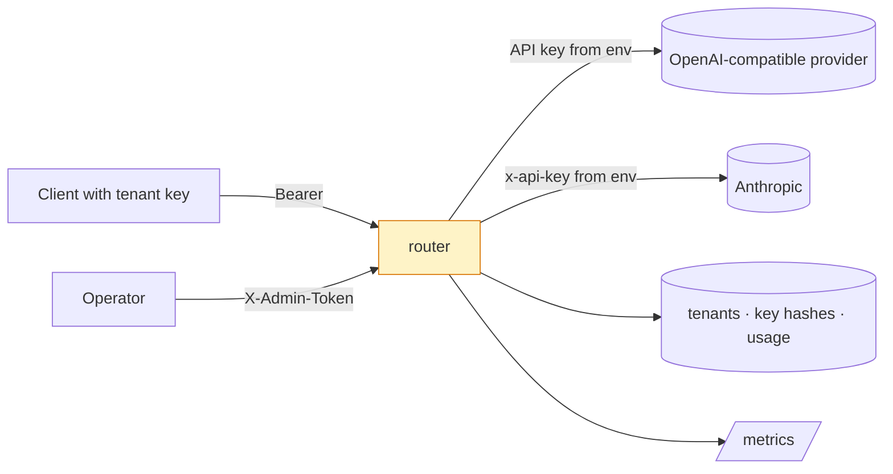

# Threat model

Scope: the router process, its database, its configuration file, and the
credentials it holds for upstream providers. Out of scope: the providers
themselves and the network between the router and them (TLS is assumed for
public providers and is the operator's job for local ones).

| # | Threat | Control | Residual |
|--:|---|---|---|
| T1 | Anyone reaching the port spends the operator's provider credit | Every completion and model-listing route requires a tenant API key; there is no anonymous route but `/health`, `/ready` and `/metrics` | `/metrics` exposes aggregate counts and provider names; put it behind the network boundary or a scraping proxy if that matters |
| T2 | A tenant spends without limit | Monthly USD budget checked before every request (402) and accounted after; per-tenant token-bucket rate limit (429 with `Retry-After`) | A tenant can overshoot the budget by at most one request, because the completion length is unknown until it arrives |
| T3 | A copy of the database yields working API keys | Keys are stored as SHA-256 with a display hint; the raw key is returned once at creation and never logged | A key intercepted in transit is valid until revoked; there is no expiry, only revocation |
| T4 | Provider credentials leak through configuration | `router.yaml` names environment variables, never values; `.env` is gitignored and CI fails if one is tracked; gitleaks scans history | Credentials exist in the process environment and in the operator's secret store |
| T5 | Provider credentials leak through logs or errors | Prompts, completions and headers are never logged; upstream error bodies are truncated to a 300-character snippet and never returned verbatim to clients beyond a generic message | The snippet is logged; a provider that echoes a key into its own error body would be logged with it |
| T6 | An admin token leak grants tenant creation | Admin routes refuse everything (503) until `ADMIN_TOKEN` is configured, compare it in constant time, and are separate from tenant auth | One static token; rotation is a restart. A deployment that needs per-operator admin identities should front these routes with its identity provider |
| T7 | A retry storm amplifies an outage | Retries are per candidate, bounded (≤5) with jittered backoff capped at 2 s; a per-provider circuit breaker stops calls after `failure_threshold` consecutive failures | The breaker is per process; a fleet of routers each trips independently |
| T8 | A client holds a worker with a huge body or a slow stream | `MAX_REQUEST_BYTES` is enforced from `Content-Length` (413); per-provider timeouts bound upstream calls | A chunked body with no length is bounded only by the upstream timeout; put a reverse proxy with a body limit in front for hostile clients |
| T9 | Poisoned configuration changes routing silently | The file is validated on start and by `model-router check` in CI: unknown providers, unpriced models, duplicate aliases and aliases that shadow provider names all refuse to load | Semantic mistakes (the wrong price) are review problems, not validation problems |
| T10 | A tenant reads another tenant's usage | Usage is keyed by tenant id and only the admin API can read it | Admin API sees every tenant by design |

## Trust boundaries

The router holds provider credentials on behalf of tenants who never see
them; that is the point of the component and the reason T1–T3 come first.

## Failure modes that fail closed

- No `ADMIN_TOKEN`: admin routes answer 503, not 200.
- No tenant key: 401 before the body is parsed.
- Unpriced model in configuration: the process does not start.
- Every candidate failing: 502 or 503, never a silently empty answer.
- Stream failing mid-way: an SSE error event and the usage so far accounted.
